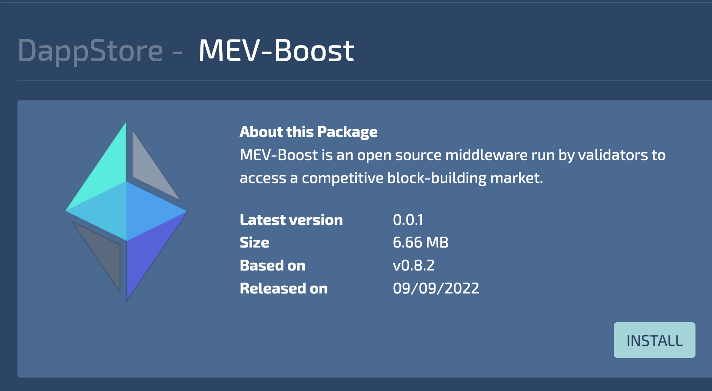
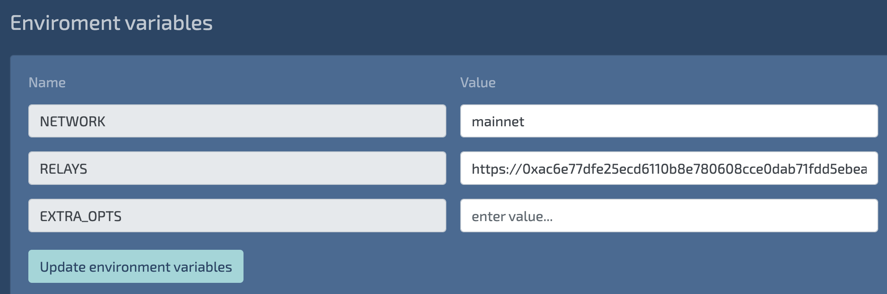

[comment]: <> (https://wiki.ava.do/e/en/tutorials/teku)

# MEV-Boost

`mev-boost` is an open source relayer to optimized block builders. By using `mev-boost` even home stakers get access to MEV (Maximal Extractable Value) rewards when they propose a block.

When you enable `mev-boost` in your validator, you can expect to get higher block rewards.

## Installation

Using `mev-boost` only makes sense if you run an Ethereum validator. So make sure you first install an execution client (e.g. Geth), a consensus layer client and a validator (e.g. Teku or Prysm).

You can find the **MEV-Boost** package in the Avada DappStore



## Configuration

You can configure MEV-Boost in the Avado UI via <http://my.ava.do/#/Packages/mevboost.avado.dnp.dappnode.eth>

The default configuration uses the FlashBots relay endpoint:
```
https://0xac6e77dfe25ecd6110b8e780608cce0dab71fdd5ebea22a16c0205200f2f8e2e3ad3b71d3499c54ad14d6c21b41a37ae@boost-relay.flashbots.net
```



You can find more relay endpoints at <https://boost.flashbots.net/>

## Links
* https://github.com/flashbots/mev-boost
* https://boost.flashbots.net/